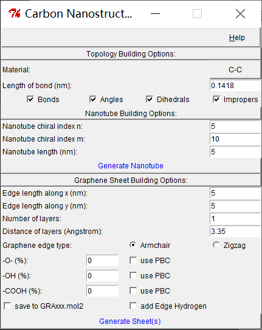
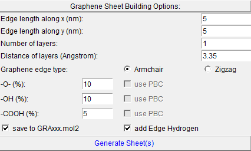
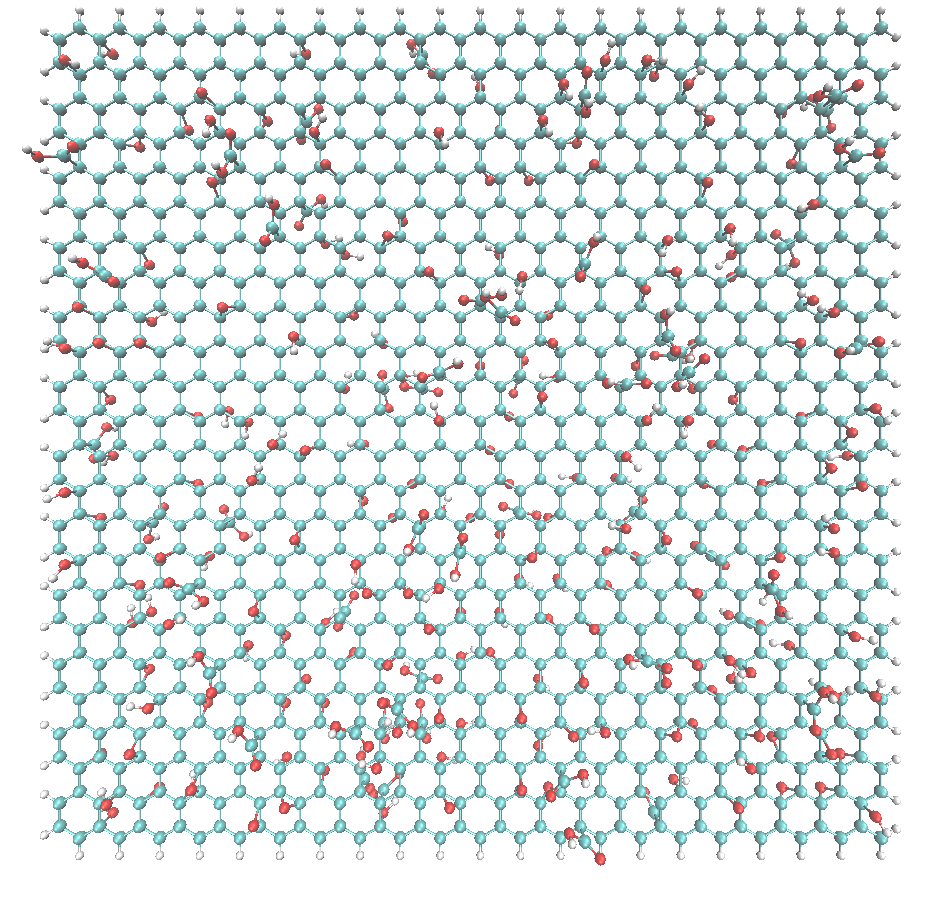

**
基于VMD软件TCL语言石墨烯功能化脚本
**

# 安装

直接将`graphene.tcl`和`gui.tcl`两个脚本替换`vmd`安装路径下文件即可，比如替换`D:\VMD\plugins\noarch\tcl\nanotube1.5`文件夹下的原程序即可。

# 使用

打开vmd程序，选择工具栏`Extensions`，然后`Modeling`，最后选择`Nanotube Builder`调出界面：

只支持石墨烯部分功能化，因此使用下面部分选项。目前的主要功能：

1. 桥氧`-O-`，羟基`-OH`，羧基`-COOH`的添加
2. 每种基团添加方式有两种，勾选`use PBC`表面该类基团会出现在石墨烯的边界碳原子上，反之不会出现。
3. 可保存当前模型为`mol2`格式，名称以`GRA_XXX.mol2`命名，包含构建时间。注意该`mol2`有正确的键连接关系很重要，可以直接用`MS`等软件进行优化结构，这是必须做的。
4. 勾选`add Edge Hydrogen`表示石墨烯边界碳原子都会添加上H原子进行饱和，因此体系是孤立的分子，上面的`use PBC`都会自动全部关闭
5. 桥氧基团百分比不能太大。因为每添加一个氧就会使得**两个碳原子**不可再次添加其他基团。

# 例子

生成一个桥氧`10%`，羟基`10%`，羧基`5%`，边界C用氢饱和的氧化石墨烯单分子：

生成文件`GRA_10%OH_5%COOH_20231104_00-21-23.mol2`，vmd重新打开该文件：

